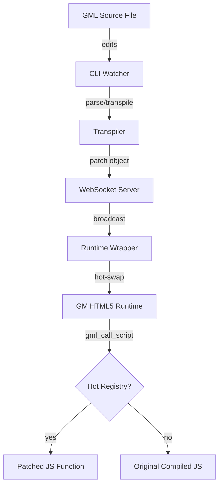

# Hot Reload: Concepts, Architecture, and Integration

This document defines the architecture, event flow, and integration strategies for the GameMaker Language hot-reloading pipeline. The goal is to allow **true hot-loading** of GML code, assets, and shaders **without restarting the game or losing runtime state**.

---

## 1. Core Concept

The hot reload system is designed to bypass the static nature of the GameMaker HTML5 runner by providing a side-channel for JavaScript "patches" generated from fresh GML source.

### The Problem
The HTML5 runner is a pre-compiled JavaScript bundle (`game.js`) that lacks a GML compiler. Once exported, the code is static; any edits to `.gml` files require a full rebuild and browser refresh, losing all in-game state.

### The Solution: A Two-Tier Pipeline
1.  **Dev Server (Node.js/CLI)**: A background process that watches GML files, transpiles them into JavaScript functions on demand, and broadcasts them as JSON patches.
2.  **Runtime Wrapper (Browser)**: A small JavaScript footprint injected into the running game that listens for patches via WebSocket and swaps function references in the GameMaker engine's internal registry.

---

## 2. System Architecture

| Component | Workspace | Responsibility |
| :--- | :--- | :--- |
| **CLI Watcher** | `@gml-modules/cli` | Monitors the filesystem, coordinates the transpilation pipeline, and manages the WebSocket server. |
| **Transpiler** | `@gml-modules/transpiler` | Parses GML via ANTLR4, converts GML AST to JS, and generates patch objects. |
| **WebSocket Server** | `@gml-modules/cli` | Streams patches in real-time to connected clients and manages re-synchronization. |
| **Runtime Wrapper** | `@gml-modules/runtime-wrapper` | Injected into the browser; maintains a hot registry of patched functions and overrides GML dispatchers. |

### Component Workflow Diagram


---

## 3. The Hot Reload Lifecycle (Event Flow)

### Phase 1: Initialization
1.  **Start Watch Command**: User runs `pnpm run cli -- watch`.
2.  **Initialize Components**: CLI creates a transpiler instance, starts the WebSocket server (default port 17890), and sets up the filesystem watcher.
3.  **Ready State**: The system begins monitoring the target directory.

### Phase 2: Detection & Transpilation
1.  **Edit Detection**: Developer saves a `.gml` file.
2.  **Debouncing**: The watcher waits (default 200ms) to catch rapid successive changes.
3.  **Processing**:
    *   **Parse**: GML source is parsed into an AST.
    *   **Emit**: `GmlToJsEmitter` generates a JavaScript function body.
    *   **Patch**: A patch object is created with metadata (kind, id, version).
4.  **Caching**: Successful patches are cached to be replayed to future clients.

### Phase 3: Patch Delivery
1.  **Broadcast**: The server sends the JSON payload to all connected browser windows.
2.  **Validation**: The Runtime Wrapper validates the patch structure before application.
3.  **Application**: A new JavaScript `Function` is created from the `js_body` and installed in the `__hot` registry.

### Phase 4: Execution
1.  **Indirection**: The `gml_call_script` (or event dispatcher) is intercepted.
2.  **Lookup**: The system checks the hot registry first.
3.  **Execution**: The new logic executes using the existing instance state (`self`, `other`, `global`).

---

## 4. Integration Strategies

To hook into the GameMaker HTML5 runtime without permanently modifying vendor files, use one of the following strategies:

### 1) Bootstrap Wrapper (Recommended)
Load the upstream runtime first, followed by a small `wrapper.js`. The wrapper locates dispatchers and routes them through the hot registry.
*   **Pros**: Works with unmodified GameMaker exports.
*   **Cons**: Relies on stable symbol discovery in the runtime.

### 2) Sidecar Iframe ("Runner-in-a-box")
Serve a development page hosting the GameMaker export in an `<iframe>`. A bridge communicates between the host and the runner via `postMessage`.
*   **Pros**: Upstream bundle stays pristine.
*   **Cons**: Adds cross-frame messaging complexity.

### 3) Service Worker Overlay
A Service Worker intercepts requests for `index.html` and injects the wrapper code dynamically during the dev session.
*   **Pros**: No persistent changes to exported artifacts.
*   **Cons**: Requires careful cache management.

---

## 5. Practical Implementation & Examples

### Starting the Pipeline
1.  **Terminal 1 (Game)**: Launch the project from GameMaker IDE for HTML5.
2.  **Terminal 2 (Prepare)**: Inject the snippet into the output:
    ```bash
    pnpm run cli -- prepare-hot-reload --html5-output /path/to/html5/export
    ```
3.  **Terminal 3 (Watch)**: Start the dev server:
    ```bash
    pnpm run cli -- watch /path/to/gml/project --verbose
    ```

### Example Patch Payload
```json
{
  "kind": "script",
  "id": "gml/script/scr_player_move",
  "js_body": "var move_speed = 10; self.x += move_speed;",
  "sourceText": "var move_speed = 10; x += move_speed;",
  "version": 1735041234567
}
```

### Options Reference

| Option | Command | Default | Description |
| :--- | :--- | :--- | :--- |
| `--websocket-port` | `watch` | `17890` | Port for the patch server. |
| `--debounce-delay` | `watch` | `100` | Delay (ms) before transpiling changes. |
| `--html5-output` | `prepare` | `(auto)` | Path to the GM HTML5 output directory. |
| `--reconnectDelay` | `client` | `800` | Client auto-reconnect delay in milliseconds. |

---

## 6. Technical Specifications

### Hot-Swappable Components
| Component | Action |
| :--- | :--- |
| **Scripts** | Replaces entry in `__hot.scripts`. Immediate swap. |
| **Object Events** | Replaces entry in `__hot.events`. |
| **Macros/Enums** | Re-evaluates constant pool and triggers dependent script rebuilds. |
| **Shaders** | Recompiles and rebinds WebGL program (taking effect next frame). |

### Special Handling: Closures
The system uses a versioned closure routing system to ensure that new closures capture the latest code:
```javascript
const make_ai = function(speed) {
  return __hot.closures["make_ai_v" + __hot.version](speed);
};
```

### Error Handling & Performance
*   **Performance**: Typical total latency (edit to live update) is **120-180ms**.
*   **Recovery**: If a patch contains a syntax error, the server broadcasts an error notification instead. The browser displays the error in the console but preserves the existing logic.
*   **Sync**: WebSocket clients that join late receive a "replay" of the latest successful patches for every symbol.

---

## 7. Future Enhancements

- [ ] Semantic analysis for automatic dependency-aware rebuilds.
- [ ] Asset hot-reloading (sprites, sounds) via resource ID stable-swapping.
- [ ] Source map generation for in-game debugging of patched GML.
- [ ] In-game UI for patch rollback and version management.

---

## References

- [Semantic Scope Plan](./semantic-scope-plan.md) - How the analyzer powers these patches.
- [CLI Source](../src/cli/src/commands/watch.ts) - Watcher implementation.
- [Transpiler Source](../src/transpiler/) - GML to JS conversion logic.
- [Runtime Wrapper Source](../src/runtime-wrapper/) - Browser-side client.
